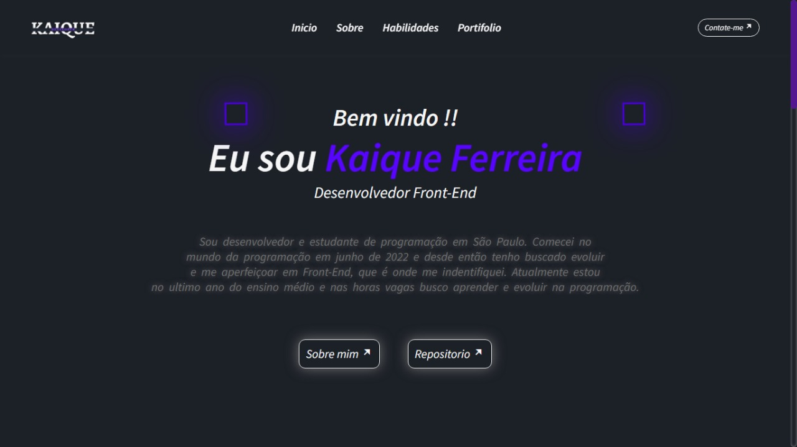

<h1 align= "center"><b> Portfólio</b></h1>

<h4 align= "center"> Projeto exclusivo produzido para amostra e conhecimento das tecnologias baseadas em Front-end</h4>

   <a href = "# tecnologia" >Tecnologia</a> &nbsp;&nbsp;&nbsp;|&nbsp;&nbsp;&nbsp;
   <a href = "# Projeto" > Projeto </a> &nbsp;&nbsp;&nbsp;|&nbsp;&nbsp;&nbsp;
   <a href = "# bibliotecas" > Bibliotecas </a> &nbsp;&nbsp;&nbsp;|&nbsp;&nbsp;&nbsp;  
   <a href = "# Links" > Links </a> &nbsp;&nbsp;&nbsp;|&nbsp;&nbsp;&nbsp;
   <a href = "#memo-lincese" > licença </a>

  

  

## 🚀 Tecnologia

<b>Foi ultilizada as seguintes tecnologias para esse projeto:<b>

> 

> 

> 

## 💻 Projeto

<b>Meu portifolio, onde me apresento e mostro minhas habilidades e minha evolução sendo desenvolvedor Front-End ! <b>

## 📚 Biblioteca

- [Remix icon](https://remixicon.com/)
- [Google Fonts](https://fonts.google.com/)
- [ScrollReveal](https://scrollrevealjs.org/)

## 🔗 Links

> 

> 

> 

## :memo: licença

Este projeto esta sobre licença MIT

---

Feito com ❤️ by Kaique Ferreira
